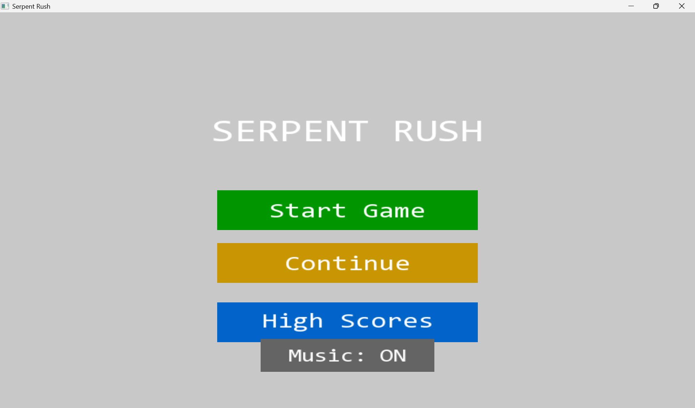
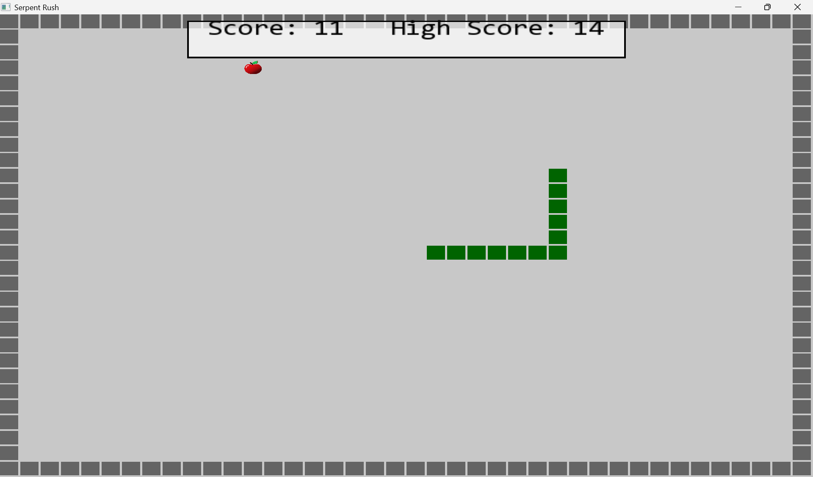
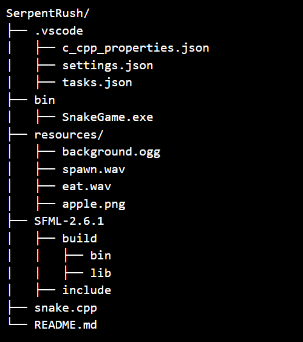

<h1>🐍 <b>Serpent Rush</b> </h1>
<h2> A Modern Take on the Classic Snake Game </h2>

  

Reviving the nostalgic Snake game with sleek visuals, intuitive controls, and enhanced gameplay! Built using C++ and SFML, it delivers a fast-paced experience with dynamic movement, score tracking, and immersive sound effects.
🚀 Get ready to slither your way to victory!

<b>🎮 Game Features</b>
✅ Modern UI – Crisp visuals with interactive buttons for seamless navigation
✅ Smooth Gameplay – Responsive controls for precise movement
✅ Score & High Score Tracking – Compete against yourself with last 5 scores saved
✅ Pause & Resume – Take a break and return anytime
✅ Customizable Assets – Modify visuals, sounds, and fonts for a personalized touch
✅ Immersive Audio – Background music & sound effects that enhance the experience

<b>🛠 Tech Stack </b>
🔹 C++17 – High-performance programming
🔹 SFML 2.x – Graphics, audio, and window handling
🔹 Standard Template Library (STL) – Efficient data structures (vector, stack, etc.)

<b>🚀 How to Play</b>
🎯 Objective: Grow the snake by eating apples while avoiding walls and self-collision.
🕹️ Controls:
- Arrow Keys – Move Up, Down, Left, Right
- Spacebar – Pause & access menu
- Enter – Restart after Game Over
🎵 Music Toggle:
- Turn background music ON/OFF with a single button in the menu
🏆 High Scores:
- View your latest 5 game scores anytime!

<b>⚙️ Installation & Setup</b>

1️⃣ Prerequisites
🔹 C++ Compiler (e.g., g++, MSVC, clang++)
🔹 SFML 2.x (Download Here)
🔹 CMake (optional for building)

<b>2️⃣ Project Structure</b>

3️⃣ <b>Build & Run</b>
<b>Windows</b>
g++ snake.cpp -o SerpentRush -lsfml-graphics -lsfml-window -lsfml-system -lsfml-audio
SerpentRush.exe

<b>Linux</b>
g++ snake.cpp -o SerpentRush -lsfml-graphics -lsfml-window -lsfml-system -lsfml-audio
./SerpentRush

<b>Mac</b>
g++ snake.cpp -o SerpentRush -lsfml-graphics -lsfml-window -lsfml-system -lsfml-audio
./SerpentRush

ℹ️ <b>NOTE</b>: Ensure SFML is correctly installed and linked in your compiler path.

🎨 Customization Options
🖼️ Visuals: Replace apple.png and snake.png for your own style
🎵 Sounds: Swap background.ogg, spawn.wav, eat.wav for custom audio
📝 Fonts: Update consolas.ttf to fit your preferred typography

🛠 Troubleshooting
❌ Game window doesn’t open? Check for missing resource files in the console.
❌ SFML linking errors? Ensure SFML is installed and properly referenced.

👨‍💻 Author
🚀 Developed by Rohit Kumar
💡 Bringing classic gameplay to the modern era!

<b>🔥 Now, slither your way to victory and challenge your reflexes in Serpent Rush!</b>

This version makes the README more engaging with emojis, better structure, and exciting wording! It also ensures clarity while making the game sound thrilling. Let me know if you’d like any further tweaks! 😃
